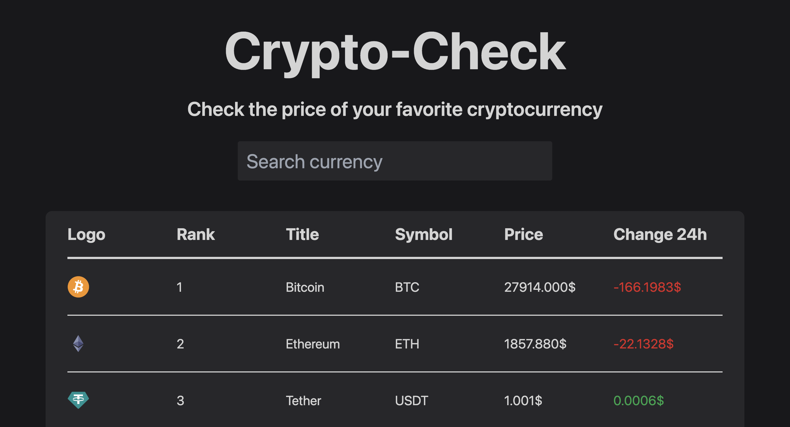

 

  <a href="https://lychakvlad.github.io/crypto-check-app/" target='_blank'>
    

<h3 align="center">Crypto-check website</h3>

  

    A site I created using the open API CoinGecko, React and Tailwind
     
    <a href="https://github.com/LychakVlad/crypto-check-app"><strong>Explore the code »</strong></a>
     
     
    <a href="https://lychakvlad.github.io/crypto-check-app/">View Demo</a>
  

<!-- ABOUT THE PROJECT -->

## About The Project

The Crypto Check App is a web application that allows users to track the current prices and trends of various cryptocurrencies. This project is developed using technologies such as React, Tailwind, and the CoinGecko API.

The application is designed to be responsive and user-friendly. It has a simple and intuitive interface that displays the current prices and trends of cryptocurrencies, as well as historical data and charts.

### Built With

- REACT JS
- TAILWIND
- CoinGeko API

## Contact

Vladislav Lychak - [@LinkedIn](https://www.linkedin.com/in/vladislav-lychak/) - lycakvladislav@gmail.com

Project Link: [https://github.com/LychakVlad/crypto-check-app](https://github.com/LychakVlad/crypto-check-app)

(<a href="#readme-top">back to top</a>)

<!-- MARKDOWN LINKS & IMAGES -->
<!-- https://www.markdownguide.org/basic-syntax/#reference-style-links -->

[react.js]: https://img.shields.io/badge/React-20232A?style=for-the-badge&logo=react&logoColor=61DAFB
[react-url]: https://reactjs.org/
